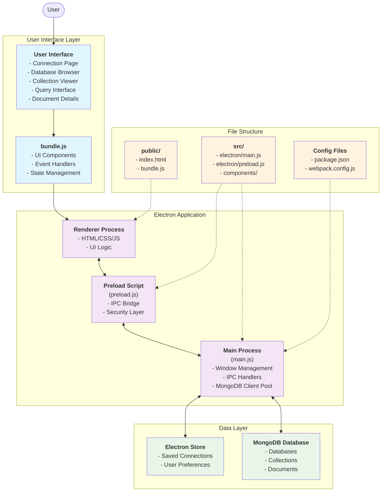
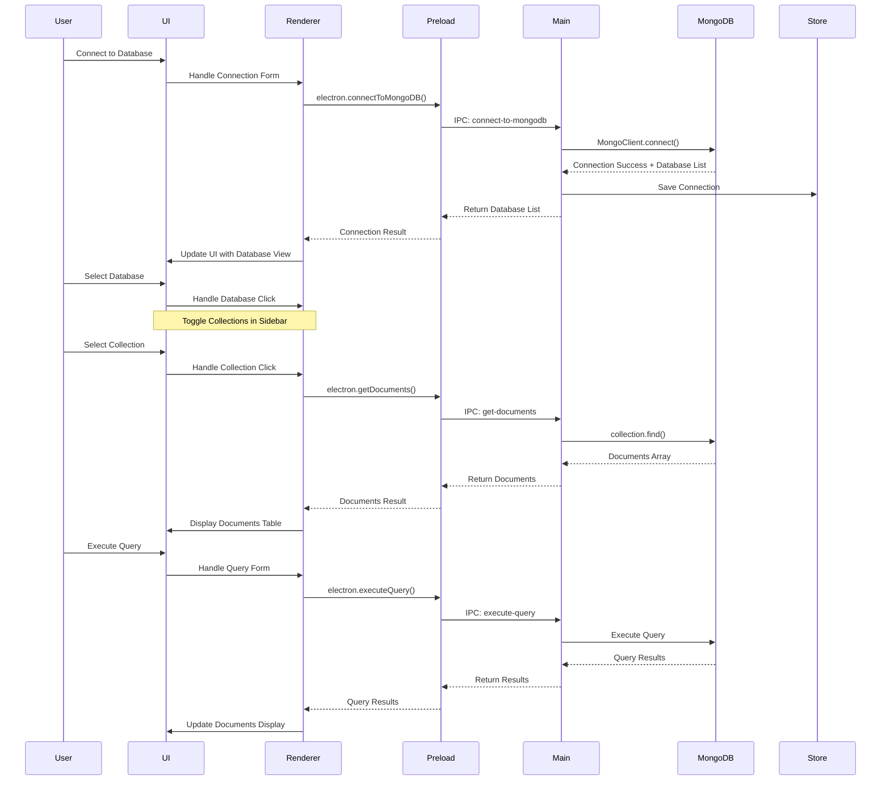
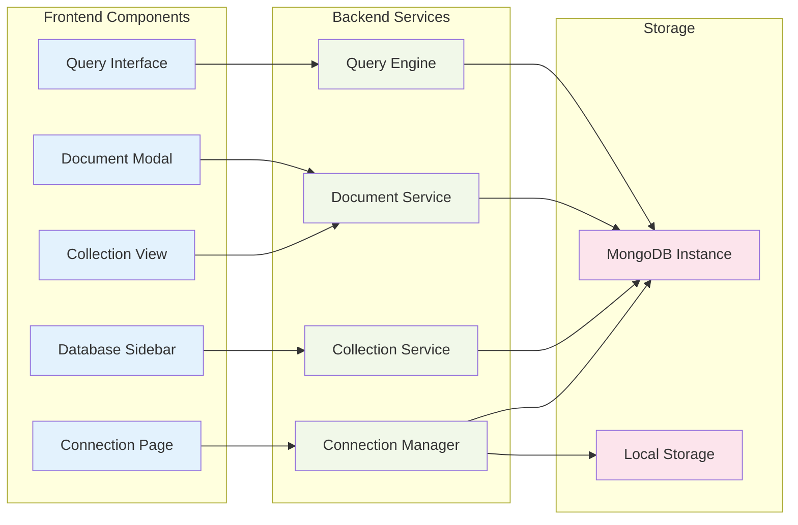

# MongoDB Client GUI Architecture

## System Architecture Flowchart

```mermaid
graph TB
    subgraph "User Interface Layer"
        UI["`**User Interface**
        - Connection Page
        - Database Browser
        - Collection Viewer
        - Query Interface
        - Document Details`"]
        Bundle["`**bundle.js**
        - UI Components
        - Event Handlers
        - State Management`"]
    end

    subgraph "Electron Application"
        Main["`**Main Process**
        (main.js)
        - Window Management
        - IPC Handlers
        - MongoDB Client Pool`"]
        
        Preload["`**Preload Script**
        (preload.js)
        - IPC Bridge
        - Security Layer`"]
        
        Renderer["`**Renderer Process**
        - HTML/CSS/JS
        - UI Logic`"]
    end

    subgraph "Data Layer"
        Store["`**Electron Store**
        - Saved Connections
        - User Preferences`"]
        
        MongoDB["`**MongoDB Database**
        - Databases
        - Collections
        - Documents`"]
    end

    subgraph "File Structure"
        PublicFiles["`**public/**
        - index.html
        - bundle.js`"]
        
        SrcFiles["`**src/**
        - electron/main.js
        - electron/preload.js
        - components/`"]
        
        Config["`**Config Files**
        - package.json
        - webpack.config.js`"]
    end

    %% User Interactions
    User([User]) --> UI
    UI --> Bundle
    Bundle --> Renderer
    
    %% IPC Communication
    Renderer <--> Preload
    Preload <--> Main
    
    %% Data Storage
    Main <--> Store
    Main <--> MongoDB
    
    %% File Dependencies
    PublicFiles -.-> Renderer
    SrcFiles -.-> Main
    SrcFiles -.-> Preload
    Config -.-> Main

    %% Styling
    classDef userLayer fill:#e1f5fe
    classDef electronLayer fill:#f3e5f5
    classDef dataLayer fill:#e8f5e8
    classDef fileLayer fill:#fff3e0

    class UI,Bundle userLayer
    class Main,Preload,Renderer electronLayer
    class Store,MongoDB dataLayer
    class PublicFiles,SrcFiles,Config fileLayer
```

## Data Flow Diagram

```mermaid
sequenceDiagram
    participant User
    participant UI
    participant Renderer
    participant Preload
    participant Main
    participant MongoDB
    participant Store

    User->>UI: Connect to Database
    UI->>Renderer: Handle Connection Form
    Renderer->>Preload: electron.connectToMongoDB()
    Preload->>Main: IPC: connect-to-mongodb
    Main->>MongoDB: MongoClient.connect()
    MongoDB-->>Main: Connection Success + Database List
    Main->>Store: Save Connection
    Main-->>Preload: Return Database List
    Preload-->>Renderer: Connection Result
    Renderer->>UI: Update UI with Database View

    User->>UI: Select Database
    UI->>Renderer: Handle Database Click
    Note over Renderer,UI: Toggle Collections in Sidebar

    User->>UI: Select Collection
    UI->>Renderer: Handle Collection Click  
    Renderer->>Preload: electron.getDocuments()
    Preload->>Main: IPC: get-documents
    Main->>MongoDB: collection.find()
    MongoDB-->>Main: Documents Array
    Main-->>Preload: Return Documents
    Preload-->>Renderer: Documents Result
    Renderer->>UI: Display Documents Table

    User->>UI: Execute Query
    UI->>Renderer: Handle Query Form
    Renderer->>Preload: electron.executeQuery()
    Preload->>Main: IPC: execute-query
    Main->>MongoDB: Execute Query
    MongoDB-->>Main: Query Results
    Main-->>Preload: Return Results
    Preload-->>Renderer: Query Results
    Renderer->>UI: Update Documents Display
```

## Component Architecture

```mermaid
graph LR
    subgraph "Frontend Components"
        A[Connection Page]
        B[Database Sidebar]
        C[Collection View]
        D[Query Interface]
        E[Document Modal]
    end

    subgraph "Backend Services"
        F[Connection Manager]
        G[Collection Service]
        H[Document Service]
        I[Query Engine]
    end

    subgraph "Storage"
        J[MongoDB Instance]
        K[Local Storage]
    end

    A --> F
    B --> G
    C --> H
    D --> I
    E --> H

    F --> J
    F --> K
    G --> J
    H --> J
    I --> J

    classDef frontend fill:#e3f2fd
    classDef backend fill:#f1f8e9
    classDef storage fill:#fce4ec

    class A,B,C,D,E frontend
    class F,G,H,I backend
    class J,K storage
```
